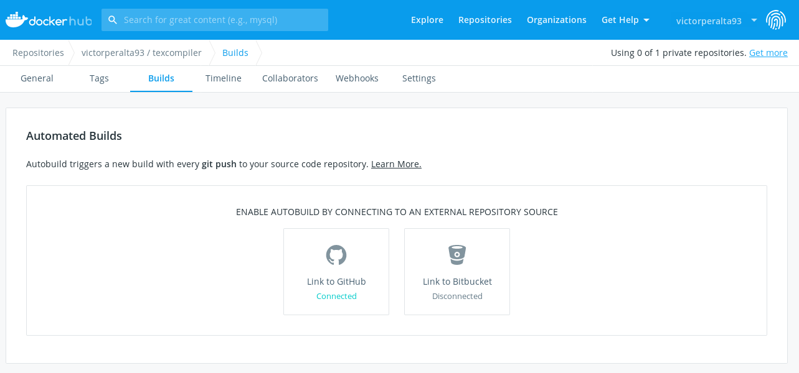
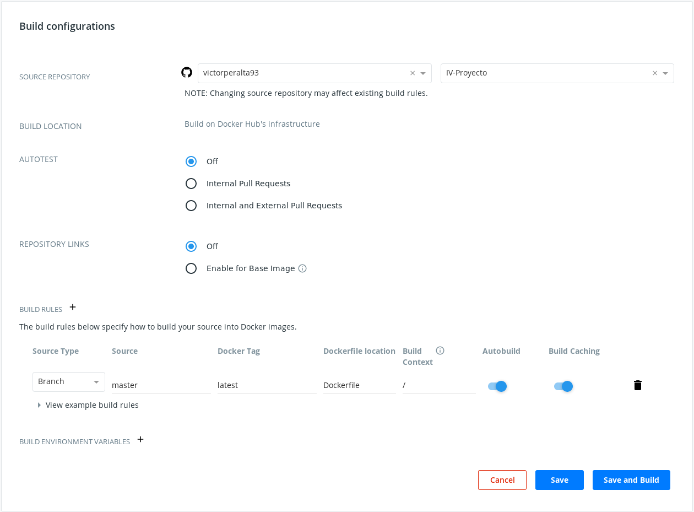

<!-- docker.md -->
# Creación y despliegue del contenedor para el servicio
## Definición del Dockerfile
El Dockerfile para este proyecto es bastante extenso debido a que la aplicación necesita diversos servicios y hay que incluirlos todos en la creación del contenedor. Para este caso sería posible utilizar `docker-compose` para aprovechar el uso de varios contenedor orquestados que proporcionaran los servicios necesarios para la aplicación. Sin embargo, me he decantado por el uso de un solo contenedor para tener la ventaja de poder descargar el proyecto con un solo comando de `dockerhub`.

A continuación vamos a analizar cada llamada utilizada en el Dockerfile.

Se utiliza como imagen base la imagen oficial de __node 13__ con su versión en __Debian Buster__. Aunque el tamaño de esta imagen es notable, he probado con varias versiones ligeras y tuve muchos problemas para instalar o TexLive o RabbitMQ o ambos.
```
FROM node:13-buster
```

Se define el directorio de trabajo, en este directorio se copiarán el resto de ficheros necesarios para el servicio.
```
WORKDIR /usr/src/texcompiler
```

Se instala la distribución TexLive, en este caso me aprovecho del _script_ que utilicé para la instalación de la misma en TravisCI. Por tanto, se copian todos los scripts del proyecto (el resto se utilizarán más adelante) y se ejecuta el script de instalación de TexLive que en este caso instala la versión _basic_ de la distribución.
```
# Instalación de TexLive
COPY scripts ./scripts/
RUN ./scripts/texlive_install.sh
```

Se actualiza la lista de paquetes con `apt-get update` y se añade el repositorio oficial de RabbitMQ para Debian. Mencionar que en la documentación de RabbitMQ se hace énfasis en que es importante descargar la última versión disponible en su servicio oficial dado que la versión incluida por defecto en `apt` suele ser obsoleta. Para poder añadir el repositorio es necesario instalar `software-properties-common`.

Tras instalar el servidor de RabbitMQ se pasa a activar el _plugin_ de mantenimiento de RabbitMQ. Ésto se hace para proporcionar la posibilidad de acceder a la interfaz de mantenimiento.
```
# Instalación de RabbitMQ
RUN apt-get update
RUN apt-get install software-properties-common -y
RUN add-apt-repository 'http://www.rabbitmq.com/debian/'
RUN apt-get install rabbitmq-server -y
RUN rabbitmq-plugins enable rabbitmq_management rabbitmq_management_agent
```

Se copian los `package*.json` para así instalar las dependencias de __node__ necesarias para que el servicio funcione correctamente. 
```
COPY package*.json ./

# instalar dependencias
RUN npm install
```

Se instala de forma general los paquetes de `Grunt` y `PM2`, ambos se utilizarán para lanzar el servicio.
```
RUN npm install -g grunt-cli
RUN npm install pm2 -g
```

Se copian el resto de archivos necesarios del proyecto.
```
COPY views ./views/
COPY src ./src/
COPY data ./data/
COPY ecosystem.config.js ./
COPY Gruntfile.js ./
```

Se definen los puertos en los cuales el contenedor va a escuchar una vez ejecutado. el puerto 5000 se utiliza para acceder al servicio y el puerto 15672 se utiliza para acceder a la interfaz de mantenimiento de RabbitMQ.
```
EXPOSE 5000
EXPOSE 15672
```

Por último se modifican los permisos de ejecución del script para lanzar el servicio y se asigna como comando principal del contenedor la ejecución de ese mismo script.
```
RUN chmod a+x scripts/start.sh
CMD ./scripts/start.sh
```

El script definido como comando principal es el siguiente:
```
#!/bin/sh
service rabbitmq-server start
PATH=/usr/local/texlive/2019/bin/x86_64-linux:$PATH; export PATH
grunt start
```

Se encarga de activar el servicio del servidor de RabbitMQ, actualizar el PATH para que detecte los comandos de TexLive y lanzar el servicio con la herramienta de construcción que se ha venido usando durante el desarrollo del proyecto.

>Es importante notar que la activación del servicio durante este paso no es trivial dado que si se activa durante la construcción de la imagen no tendrá efecto una vez el contenedor esté ejecutándose.

Una vez definido el Dockerfile se puede construir la imagen

```
sudo docker image build -t victorperalta93/texcompiler .
```

Por último se puede arrancar el contenedor

```
sudo docker run -it -p 80:5000 -p 15672:15672 victorperalta93/texcompiler
```

Esto arrancará el contenedor y mapeara su puerto 5000 al puerto 80 del _host_ y su puerto 15672 al mismo del _host_.

## _DockerHub_
Una vez generada la imagen del contenedor, es posible subirla a [DockerHub](https://hub.docker.com/) y así proveer del servicio del proyecto en forma de contenedor a todo el que quiera utilizarlo, también será la base para desplegar el contenedor en Heroku y Azure.  
Para hacer esto es tan simple como ejecutar:
```
sudo docker push victorperalta93/texcompiler
```
Una vez subido el contenedor, es posible configurarlo para automatizar su construcción cada vez que se actualiza el repositorio del proyecto en GitHub.

Para ello hay que dirigirse a la pestaña _Builds_:



y asignar el repositorio del proyecto:



## Despliegue del contenedor en Heroku
[Heroku ofrece dos alternativas](https://devcenter.heroku.com/categories/deploying-with-docker) para desplegar un contenedor, para desplegar mi aplicación he elegido definir un `heroku.yml` para construir la imagen.

```
build: 
  docker:
    web: Dockerfile
```

Hecho esto basta con definir el _stack_ _container_ en Heroku para indicar que queremos utilizar el contenedor Docker para desplegar la aplicación

```
heroku stack:set container
```

En mi caso, como habíamos configurado el despliegue automático a Heroku una vez el repositorio de GitHub pasase los tests unitarios y de integración solo necesito hacer `git push origin master` para que el contenedor se despliegue en Heroku. Aunque una vez hecho me he dado cuenta de que de esta forma estoy perdiendo la aplicación que se desplegó anteriormente. Por tanto, he decidido conservar la misma y desplegar el contenedor en una aplicación distinta en Heroku. 

>Para volver a la configuración inicial de _stack_ puedes utilizar `heroku stack:set heroku-18` (es el _stack_ por defecto a Diciembre de 2019)

Aprovecharé el utilizar una aplicación nueva para definir los pasos a seguir si queremos reproducir el despliegue del contenedor.

1. crear la nueva aplicación
   ```
    heroku apps:create --region eu texcompiler-docker
   ```
2. asignar el _stack_
    ```
    heroku stack:set container
    ```
3. subir a heroku
   ```
   git push heroku master
   ```