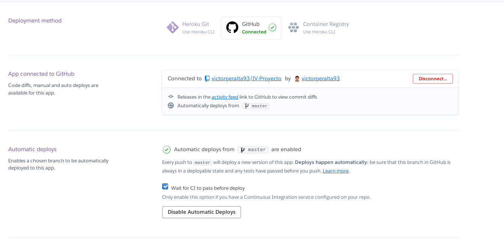

<!-- paas.md -->
## Elección de un PaaS para el proyecto
Mi proyecto es algo especial con respecto a la mayoría de proyectos en el sentido de que necesito un PaaS que pueda proporcionar RabbitMQ como servicio. Dado que es algo necesario para este proyecto, se convierte en la prioridad principal a la hora de elegir un PaaS.
Los PaaS estudiados han sido: OpenShift, Microsoft Azure, Heroku, Zeit y BlueMix.

Comenzaré exponiendo rápidamente las razones por las que he rechazado la mayoría de estos. OpenShift ofrece soporte para RabbitMQ, pero su configuración parece bastante complicada, Microsoft Azure lo ofrece (y además parece un proceso relativamente sencillo), pero el plan de pago mínimo para utilizarlo son 99€/mes. Zeit parece una plataforma que se centra en _frontend frameworks_ y por tanto no tiene mucho sentido en este proyecto. Por último BlueMix sólo ofrece un periodo de prueba de 30 días.

## Heroku
Todo esto nos deja con Heroku, que no solo es de código abierto, si no que ofrece el servicio completamente gratuito (aunque con algunas restricciones, que no afectan mucho a este proyecto). Ofrece RabbitMQ como un _add-on_ y éste tiene un plan gratuito!

## Despliegue en Heroku
* conecta a tu cuenta de Heroku con `heroku login`
* crea la aplicación indicando región europa, si no especificas la región se creará automáticamente en US y migrar la aplicación a Europa no es trivial (si te ha ocurrido puedes ver como hacerlo [aquí](https://devcenter.heroku.com/articles/app-migration)). A continuación de la región indica el nombre de la aplicación: `heroku apps:create --region eu texcompiler`.
* añade el _add-on_ __cloudamqp__, dicho servicio provee RabbitMQ a nuestra aplicación: `heroku addons:create cloudamqp:lemur`. lemur es el plan elegido, gratis y con las características más que suficientes para el propósito de este proyecto.
* añade el _buildpack_ de nodejs: `heroku buildpacks:set heroku/nodejs`. Dicho _buildpack_ automatiza la construcción de la aplicación.
* añade el _buildpack_ para instalar TexLive en la aplicación (más sobre este tema a continuación): `heroku buildpacks:add https://github.com/vperaltac/heroku-buildpack-tex`.
* sube los cambios al repositorio de heroku para comenzar el despliegue: `git push heroku master`

Todo este proceso se ha automátizado en una tarea en Grunt:

```
shell: {
    options: { stdout: true },
    create: 'heroku apps:create --region eu texcompiler',
    cloudamqp: 'heroku addons:create cloudamqp:lemur',
    bpnodejs: 'heroku buildpacks:set heroku/nodejs',
    bptex: 'heroku buildpacks:add https://github.com/vperaltac/heroku-buildpack-tex',
    push: 'git push heroku master'
},
```

Podrás ver cómo falta el primer paso, hacer login en heroku. Dicho paso no está incluido porque al utilizarlo la secuencia no continuaba una vez logueado. Si funciona correctamente utilizando un `makefile` pero quería mantener todas las tareas en mi herramienta de construcción seleccionada, por tanto decidí eliminarlo para conservar el uso de Grunt. __Si quieres replicar esta aplicación asegurate de hacer `heroku login` antes de `grunt deploy`.__

Para lanzar dicha tarea utiliza:

```
grunt deploy
```

## Despliegue automático a Heroku con GitHub
Heroku permite lanzar su despliegue cada vez que se hace un `push` al repositorio de GitHub, para esto puedes dirigirte a la pestaña _Deploy_ de tu aplicación en el _Dashboard_ de Heroku y activar como método de despligue GitHub, seleccionar el repositorio e indicar que sólo se realize el despliegue si la integración continua ha finalizado con éxito.




## _buildpack-tex_
Uno de los desafíos de desplegar mi aplicación en un PaaS (a parte de necesitar el servicio de RabbitMQ) ha sido encontrar la forma de instalar la distribución de TexLive necesaria en la aplicación de Heroku. Por suerte, parece que no soy el único que ha necesitado esto dado que hay un repositorio en GitHub que proporciona justo esto: [https://github.com/Thermondo/heroku-buildpack-tex](https://github.com/Thermondo/heroku-buildpack-tex).  

Se ha visto en el tema de teoría cómo Heroku proporciona herramientas por defecto que se encargarán de configurar e instalar todo lo necesario para cada tipo de aplicación (en mi caso utilizo NodeJS pero también esta disponible para Ruby, Python, Java y otros tantos). Llaman a estas herramientas _buidpacks_, pues tambien permiten añadir _buildpack_ creados por los usuarios que añadan herramientas extra a las aplicaciones o _dynos_. El repositorio anterior es justo eso, un _buildpack_ que añade la posibilidad de tener la distribución TexLive en nuestra aplicación.

Por último añadir que he utilizado mi propio fork de dicho repositorio porque permiten añadir los paquetes que necesitemos en un fichero extra, en mi caso: `pdftexcmds`. Por alguna razón inicialmente no me compilaban los archivos en la aplicación por falta de este paquete.

## Procfile
Heroku permite designar el comando a ejecutar para lanzar nuestro servicio en el fichero `Procfile`. Dicho fichero en este proyecto tiene esta pinta:

```
release: npm install pm2 -g; npm install -g grunt-cli
web: grunt start
```

`web: grunt start` es el comando principal. El proceso `web` es el único que puede recibir peticiones HTTP, por tanto es importante que el servicio de `Express` se inicie en dicho servicio. Cómo siempre, para lanzar el servicio se utiliza la herramienta de construcción del proyecto.

existe un tipo de proceso especial llamado `release`. Cada vez que se vaya a desplegar una nueva versión de la aplicación se llamará a este comando. Esto me permite instalar __PM2__ y __Grunt__ para poder lanzar mi aplicación.

Existe otro tipo de proceso llamado `worker`, esto generará dynos extra que se pueden encargar de realizar procesamiento pesado (como compilar documentos) para el proceso principal. Suena perfecto para esta aplicación, ¿verdad? Hay que tener en cuenta que __no comparten el mismo sistema de archivos__ y por tanto tendrás que realizar un envío extra desde el proceso `web` a cada `worker` para realizar la compilación correctamente.

Por tanto, me decanté por utilizar __PM2__ para lanzar 4 _workers_ en modo _cluster_. Probablemente esta solución no sea la más eficiente, pero evita el envío de ficheros entre dynos, algo que tras buscar información no encontré nada relativamente sencillo. Con respecto a este tema, puede que durante el desarrollo del proyecto siga intentando implementarlo. Si es así, actualizaré este documento una vez implementado.

## A dónde ir desde aquí
Durante el desarrollo de esta parte del proyecto se han introducido cambios significativos a la forma en la que la aplicación maneja el sistema de mensajería. También se han añadido nuevas peticiones REST y se ha modificado la forma de levantar el servicio. Para leer más sobre esto puedes leer el apartado De __RPC a Work Queues__ en el [diario de desarrollo](diario.md).