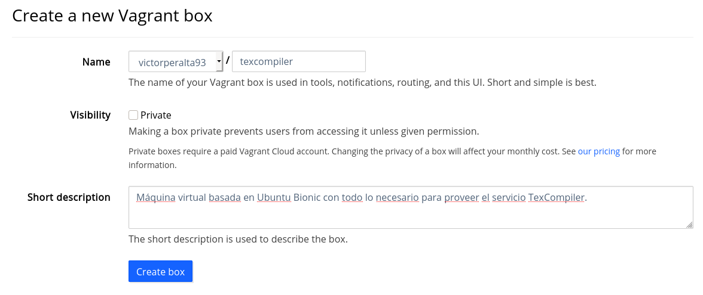

<!-- provisionamiento.md -->
# Provisionamiento de máquinas virtuales
Para realizar el provisionamiento de la máquina virtual he utilizado [ansible](https://www.ansible.com/) y [Vagrant](https://www.vagrantup.com/).
Vagrant utiliza `Vagrantfile` para definir la configuración de la máquina virtual:

```
# -*- mode: ruby -*-
# vi: set ft=ruby :

Vagrant.configure("2") do |config|
  config.vm.box = "ubuntu/bionic64"

  config.vm.network "private_network", ip: "192.168.33.10"

  config.vm.provision :ansible do |ansible|
    config.vm.network "forwarded_port", guest: 80, host: 8086
    ansible.playbook = "playbook.yml"
  end
end
```
Con este fichero se crea una máquina virtual con sistema operativo base __Ubuntu Bionic__. Si quieres saber más sobre la elección de este SO base puedes leer [este apartado](eleccion_so.md). Se define tambien la ip de la máquina y como sistema de provisionamiento a ansible.

los principales ficheros de configuración de ansible son el `playbook` y el fichero de configuración de los _hosts_ o `inventory`. Éste último no es necesario porque Vagrant configura uno específico para nuestra imagen. Por tanto sólo es necesario definir el `playbook` de ansible, dado que es algo largo, vamos a mostrarlo orden por orden y añadir una breve descripción de ellas.

Es necesario instalar `wget` para la instalación de TexLive.
```
- name: Instalar wget
apt:
    name: wget
    state: present
    update_cache: yes
```


> Es importante instalar siempre desde el repositorio actualizado que provea el servicio en cuestión, dado que `apt` o `dnf` no siempre tienen las versiones más actualizadas de los servicios que necesitemos. De hecho, suele ser lo contrario y tener versiones muy antíguas.

Instalación de __NodeJS__: para ello hay que actualizar el repositorio primero y después instalarlo. Cabe indicar que get_url siempre necesita que indiquemos un destino para el fichero a descargar:

```
- name: Descargar script de repositorio de Node.js
get_url:
    url: https://deb.nodesource.com/setup_13.x
    dest: /home/vagrant/setup_13.x

- name: Añadir repositorio de Node.js
shell: bash /home/vagrant/setup_13.x

- name: Instalar Node.js
apt:
    name: nodejs
```

>Node.js viene con npm integrado, por lo que no hace falta instalarlo. 

Instalación de la herramienta de construcción del proyecto: __Grunt__.
```
- name: Instalar Grunt
npm:
    name: grunt-cli
    global: yes
```

Instalación del gestor de procesos __PM2__, necesario para arrancar el servicio:

```
- name: Instalar PM2
npm:
    name: pm2
    global: yes
```

Instalación de __TexLive__, he tenido que crear un script distinto para vagrant debido a que la provisión de ansible se realiza desde un directorio diferente que el resto de sistemas que utilizan este script:
```
- name: Instalar TexLive
script: scripts/texlive_install_vagrant.sh
```

Instalación de `esl-erlang`, es una dependencia de RabbitMQ:
```
- name: Descargar esl-erlang
get_url:
    url: https://packages.erlang-solutions.com/erlang-solutions_1.0_all.deb
    owner: vagrant
    dest: /home/vagrant/erlang-solutions_1.0_all.deb
    
- name: Install esl-erlang
apt:
    deb: /home/vagrant/erlang-solutions_1.0_all.deb
```

>Nota: aunque es posible utilizar curl para algunas tareas como la anterior, al utilizarlo ansible daba un mensaje de _warning_ indicando que era mejor utilizar `get_url` o `url`. Por tanto todo este tipo de tareas utilizan `get_url`.

Instalación de RabbitMQ, de nuevo asegurando instalar su versión más reciente y evitar la versión de `apt`:

```
- name: descargar script de repositorio de RabbitMQ
get_url:
    url: https://packagecloud.io/install/repositories/rabbitmq/rabbitmq-server/script.deb.sh
    dest: /home/vagrant/script.deb.sh

- name: Añadir repositorio de RabbitMQ
shell: bash /home/vagrant/script.deb.sh

- name: Instalar RabbitMQ
apt:
    name: rabbitmq-server=3.7.23-1
```

La ejecución del provisionamiento debería mostrar una salida similar a la siguiente:

```
==> default: Running provisioner: ansible...
Vagrant has automatically selected the compatibility mode '2.0'
according to the Ansible version installed (2.9.1).

Alternatively, the compatibility mode can be specified in your Vagrantfile:
https://www.vagrantup.com/docs/provisioning/ansible_common.html#compatibility_mode

    default: Running ansible-playbook...

PLAY [all] *********************************************************************

TASK [Gathering Facts] *********************************************************
ok: [default]

TASK [Instalar wget] ***********************************************************
ok: [default]

TASK [Descargar script de repositorio de Node.js] ******************************
changed: [default]

TASK [Añadir repositorio de Node.js] *******************************************
changed: [default]

TASK [Instalar Node.js] ********************************************************
changed: [default]

TASK [Instalar Grunt] **********************************************************
changed: [default]

TASK [Instalar PM2] ************************************************************
changed: [default]

TASK [Instalar TexLive] ********************************************************
changed: [default]

TASK [Descargar esl-erlang] ****************************************************
changed: [default]

TASK [Install esl-erlang] ******************************************************
changed: [default]

TASK [descargar script de repositorio de RabbitMQ] *****************************
changed: [default]

TASK [Añadir repositorio de RabbitMQ] ******************************************
changed: [default]

TASK [Instalar RabbitMQ] *******************************************************
changed: [default]

PLAY RECAP *********************************************************************
default                    : ok=13   changed=11   unreachable=0    failed=0    skipped=0    rescued=0    ignored=0   
```

## Gestor de tareas

Como viene siendo costumbre en el proyecto, estas órdenes se pueden ejecutar desde la herramienta construcción Grunt:

```
grunt vagrant-up
```
El provisionamiento se ejecutará directamente al terminar la instalación del sistema operativo base.

Si quieres lanzar el provisionamiento en cualquier momento, puedes utilizar:
```
grunt provision
```

Por último tambien es posible parar la máquina:
```
grunt vagrant-halt
```

Se han añadido las siguientes líneas al `Gruntfile` para proveer los comandos anteriores:
```
    ...
      vagrant_up:{
        cmd: 'vagrant',
        args: ['up']
      },

      vagrant_halt:{
        cmd: 'vagrant',
        args: ['halt']
      },

      provision:{
        cmd: 'vagrant',
        args: ['provision']
      },
    ...

  grunt.registerTask('vagrant-up',['run:vagrant_up']);

  grunt.registerTask('vagrant-halt',['run:vagrant_halt']);

  grunt.registerTask('provision',['run:provision']);
```

## Publicación de la imagen en Vagrant Cloud
Para subir la imagen a [Vagrant Cloud](https://app.vagrantup.com/) hay que seguir los siguientes pasos:
1. crea la _caja_ de tu máquina virtual:
    ```
    vagrant package
    ```
2. Crea la _caja_ en la web:
   
    
3. Añade se proveedor (virtualbox en este caso) y sube el fichero .box generado en el paso 1

4. Por último, no olvides marcar la versión como release para que esté disponible

Puedes ver la VM de este proyecto en [su url de Vagrant Cloud](https://app.vagrantup.com/vperaltac/boxes/texcompiler).