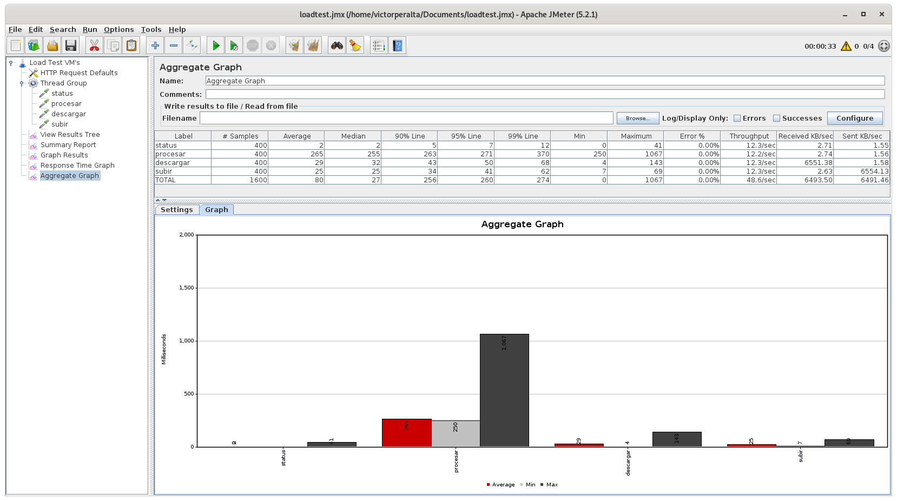
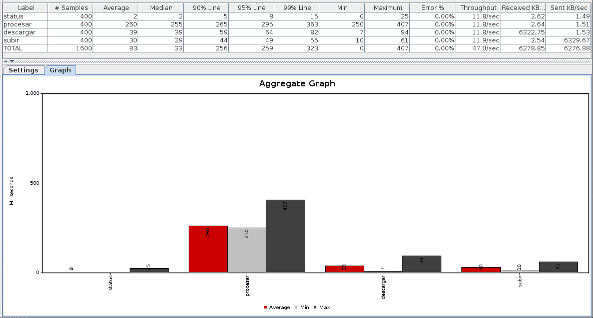
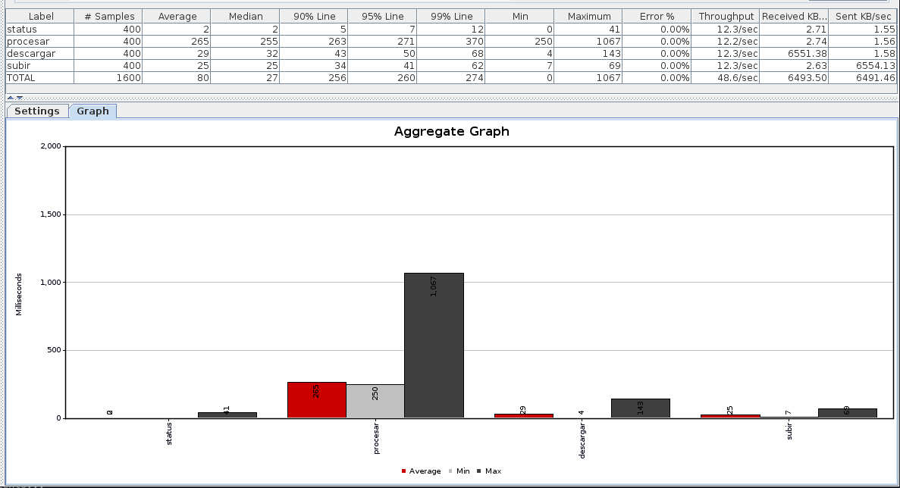

<!-- tests.md -->
## Introducción

Antes de trabajar con ansible y desarrollar el provisionamiento vamos a realizar una evaluación de prestaciones de varias posibles imágenes base (`base boxes`) para elegir la más conveniente para el proyecto.
Las máquinas a probar son las siguientes:
  * Ubuntu 16.04 (Xenial)
  * Ubuntu 18.04 (Bionic)
  * Debian Jessie
  
Para realizar la evaluación se van a tener en cuenta los siguientes parámetros:
  * Tamaño de la imagen
  * Resultados de test de carga

Para realizar los tests de carga se va a utilizar [JMeter](https://jmeter.apache.org/).

## Tests de carga
Como se mencionó en la introducción, para comparar las máquinas se ha hecho uso de tests de carga, para realizar los mismos he creado una pequeña API con Express que acepta varios tipos de peticiones, vamos a ver cada uno de ellos y comentarlos brevemente.

### GET status
```
app.get('/status',(req,res) => {
    res.status(200).json({status: 'OK'})
});
```
Sirve como la petición más básica, un simple JSON para confirmar que el servicio está disponible (algo que ya conocemos de fases anteriores a este proyecto).

### GET procesar
```
app.get('/procesar',(req,res) =>{
    setTimeout(() => {
        console.log("Realizando procesamiento...");
        res.send('Procesamiento finalizado.');
    }, 250)
});
```
Esta petición sirve para simular cierta carga de trabajo en el servidor, en este caso 250 ms. Este tiempo no ha sido elegido de forma aleatoria, ya que la aplicación del proyecto tarda unos 200 ms en realizar la tarea de compilación. He querido simplificar las llamadas para los tests y no añadir RabbitMQ para acercarlos más a la realidad ya que complicaría bastante la comparación entre las máquinas.

### GET descargar y POST subir
Una parte importante de mi proyecto es la subida y bajada de ficheros, por tanto he añadido 2 peticiones para realizar esto mismo:
```
app.get('/descargar', (req,res) => {
    let pdf = 'gdocenteiv.pdf';
    res.download(pdf);
});

app.post('/subir', (req,res) => {
    if(!req.files)
        return res.status(400).send('No se encontró el archivo fuente.');
    
    if(!req.files.documento)
        return res.status(400).send('Nombre incorrecto.');

    let documento = req.files.documento;
    let nombre = req.files.documento.name;
    let destino = 'data/' + nombre;

    documento.mv(destino, function(err){
        if(err)
            return res.status(500).send(err);

        res.status(200).send("Archivo subido.");
    });
});
```

## Configuración de JMeter
Aunque no voy a explicar la configuración al completo de JMeter porque eso no entra en las competencias de esta asignatura, si que me gustaría mostrar los puntos clave de la configuración utilizada para realizar los tests de carga sobre las diferentes máquinas virtuales.

La configuración utilizada es la siguiente:
* Threads (clientes): 4
* Loop Count: 100

Por tanto, se harán 400 peticiones de cada tipo descrito en el apartado anterior. Una vez realizadas las peticiones se generan resultados en diferentes tablas y gráficos, los cuales mostraremos en los siguientes apartados. Si tienes curiosidad por ver la pinta que tienen los tests una vez configurados en JMeter los muestro en la siguiente imagen:



## Resultados
A continuación se mostrarán los gráficos resultado de los tests realizados a las 3 máquinas virtuales, dicho grafo muestra los ms medios, máximo y mínimo de cada petición.

### Ubuntu bionic



### Debian Jessie



### Ubuntu Xenial


La siguiente tabla muestra una comparación entre los tiempos __medios__ por cada petición:

|               | status | procesar | descargar | subir |
|:-------------:|:------:|:--------:|:---------:|:-----:|
| Ubuntu Xenial |    2   |    258   |     37    |   29  |
| Ubuntu Bionic |    2   |    260   |     39    |   30  |
| Debian Jessie |    2   |    265   |     29    |   25  |

La siguiente tabla muestra una comparación entre los tiempos __mínimos__ por cada petición:

|               | status | procesar | descargar | subir |
|:-------------:|:------:|:--------:|:---------:|:-----:|
| Ubuntu Xenial |    0   |    250   |     7     |   11  |
| Ubuntu Bionic |    0   |    250   |     7     |   10  |
| Debian Jessie |    0   |    250   |     4     |   7   |

La siguiente tabla muestra una comparación entre los tiempos __máximos__ por cada petición:

|               | status | procesar | descargar | subir |
|:-------------:|:------:|:--------:|:---------:|:-----:|
| Ubuntu Xenial |   48   |    526   |     97    |   87  |
| Ubuntu Bionic |   25   |    407   |     94    |   61  |
| Debian Jessie |   41   |   1067   |    143    |   69  |

Estos datos muestran que la media de las peticiones en las diferentes máquinas es muy similar pero en sus valores máximos es donde se encuentran las mayores diferencias, dando Debian un máximo de 1067 ms para la petición procesar cuando Ubuntu Bionic tiene como máximo menos de la mitad: 407 ms.

Por último queda comparar el tamaño de las imágenes (o boxes en este caso) de las máquinas virtuales. Dado que he utilizado Vagrant para crear dichas máquinas, voy a aprovecharlo también para generar _boxes_ de cada máquina y comparar su tamaño.
```
vagrant package id-box
```

Los tamaños de las _cajas_ generadas son los siguientes:

| Ubuntu Xenial | Ubuntu Bionic | Debian Jessie |
|:-------------:|:-------------:|---------------|
|    600.7 MB   |    490.2 MB   | 655.7 MB      |

## Conclusiones
Con respecto a los tiempos de respuesta en las peticiones, dado que las medias son muy similares me decanto más por tener en cuenta el máximo de cada máquina, si ese es el caso el claro ganador sería Ubuntu Bionic. Además, con respecto al tamaño de las _cajas_ generadas el claro vencedor es también Ubuntu Bionic y por tanto será la máquina a utilizar para realizar el provisionamiento.